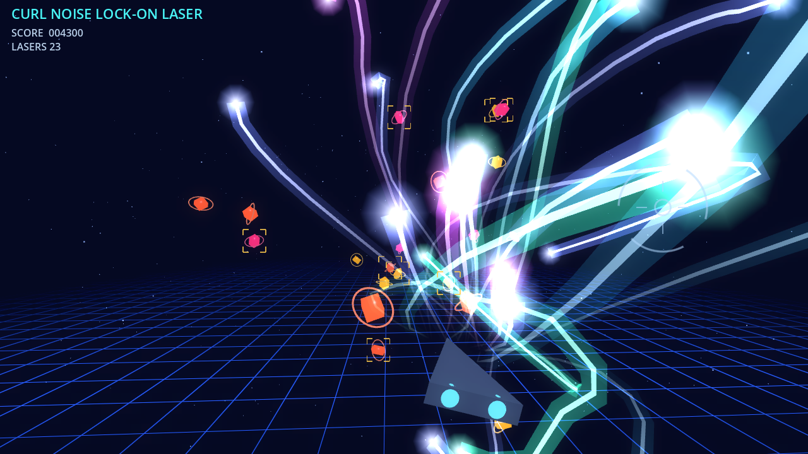
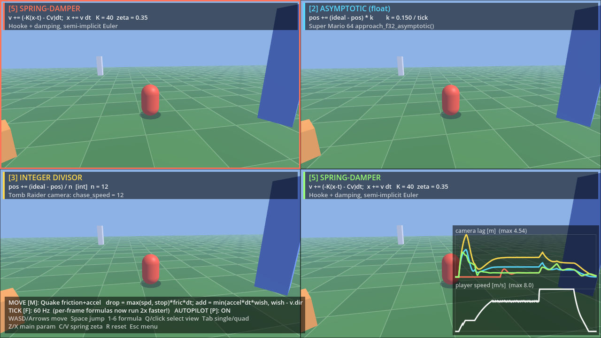

# Godot 3D Demos (Godot 4.3)

起動するとメニューが出て、2つのデモを選べます（各デモで `Esc` を押すとメニューに戻ります）。
どちらも Godot 4.3 の Compatibility レンダラ（WebGL2）で動くので、そのままブラウザで動かせます。

1. **Curl Noise Lock-on Laser** — カールノイズで軌道を曲げる、3D空間のロックオンレーザー
2. **Camera / Spring / Inertia Lab** — 1996年頃のゲームで使われたカメラ追従・慣性の式を並べて比較

---

## 1. Curl Noise Lock-on Laser



### 操作

| 入力 | 動作 |
| --- | --- |
| 左クリック長押し / タッチ長押し / Space 長押し | 照準をなぞって敵をロックオン（1体につき最大4回、合計24回まで） |
| 離す | ロックした数だけホーミングレーザーを発射 |
| `A` | 自動デモの ON/OFF（3秒操作がないと、自動でロックして発射します） |
| `C` | カールノイズの ON/OFF（違いを見比べる用） |

### 仕組み

- `scripts/curl_noise.gd` — 3つの Simplex ノイズをベクトルポテンシャル ψ とし、
  中心差分で `curl ψ` を計算します。発散ゼロの流れ場なので、湧き出しや吸い込みがなく、
  滑らかに渦を巻く軌道になります。時間でサンプル位置をずらして流れ場を変化させています。
- `scripts/laser_system.gd` — 各レーザーは
  `位置 = lerp(発射位置, 目標, u^1.7) + オフセット × エンベロープ(u)` で動きます。
  オフセットは発射時に外向きの初速を与えた粒子で、カールノイズの力を受けながら減衰します。
  飛行時間の終盤でエンベロープを 0 にするので、どれだけ曲がっても必ず命中します。
  軌跡はカメラに向いたリボン（太い発光層＋細い芯）と先端のフレアを
  1つの `ArrayMesh` に毎フレームまとめて描画しています（加算合成）。
- `scripts/enemy.gd` — 敵も同じカールノイズの流れに乗って漂います。
- `scripts/main.gd` — シーン構築、ロックオン判定（画面上の照準円との距離）、
  発射キュー、爆発エフェクト、自動デモ。
- `scripts/hud.gd` — 照準・ロックオンマーカー・スコアの 2D 描画。

主なパラメータ（`laser_system.gd` 冒頭）:
`CURL_STRENGTH`（曲がり具合）、`DAMPING`（減衰）、`TRAIL_LEN`（軌跡の長さ）、
`GLOW_WIDTH` / `CORE_WIDTH`（太さ）。流れ場の細かさは `main.gd` の `CurlNoise.new(seed, frequency)` です。

---

## 2. Camera / Spring / Inertia Lab



同じキャラクターを最大4台の追従カメラで同時に映し、それぞれ別の式で動かして、
遅れ・行き過ぎ・整数演算の誤差を見比べます。右下のグラフは各カメラの遅れ（理想位置からの距離）と、
キャラクターの速度です。3秒操作しないとキャラクターが自動で歩き回ります。

### カメラの式（`1`〜`6` で選択中の画面の式を切り替え）

| キー | 式 | 由来 |
| --- | --- | --- |
| 1 | `pos = ideal` | Quake `chase.c`：追従なしで目標位置へ直接移動 |
| 2 | `pos += (ideal - pos) * k` | Super Mario 64 `approach_f32_asymptotic()` |
| 3 | `pos += (ideal - pos) / n`（整数） | Tomb Raider のカメラ（`chase_speed = 12`）。切り捨てで目標の手前に止まる |
| 4 | `pos += (ideal - pos) >> s`（固定小数点 1.0 = 4096） | PS/サターン風。シフトは負方向に丸めるので誤差が左右非対称 |
| 5 | `v += (-K(x - t) - C v) dt; x += v dt` | バネ＋ダンパー（半陰的オイラー法）、`C = 2ζ√K` |
| 6 | `pos = lerp(pos, ideal, 1 - exp(-λ dt))` | 現代の、フレームレートに依存しない形（比較用） |

### キャラクターの慣性（`M` で切り替え）
- **SM64 walk** — `v += 1.1 - v/43`（1フレームごと）、入力なしで `v -= 1`、上限48
- **Quake** — `pmove.c` の摩擦（`max(speed, stopspeed) * friction * dt` を減らす）と加速
- **No inertia** — 入力をそのまま速度にする

### カメラのロール（全画面共通）
左右の入力で、カメラが旋回方向へ傾きます（最大12°）。傾きはバネ＋ダンパーで追従するので、
キーを押すと少し行き過ぎてから落ち着き、離すと揺り戻してから水平に戻ります。

```
target = 左右入力 × 12°
w += (-K (roll - target) - C w) dt     // C = 2ζ√K
roll += w dt
```
dt を使うので、30Hz と 60Hz で挙動は変わりません。右下の3段目のグラフにロール角を表示します。

### 操作
| 入力 | 動作 |
| --- | --- |
| `W` `A` `S` `D` / 矢印 | 前進・旋回（ラジコン操作）／ `Space` ジャンプ |
| `1`〜`6` | 選択中の画面のカメラの式 |
| クリック / `Q` | 画面の選択 ／ `Tab` 1画面と4画面の切り替え |
| `Z` / `X` | 選択中の式の主パラメータ（k, n, s, K, λ）を下げる・上げる |
| `C` / `V` | バネの減衰比 ζ を下げる・上げる（1.0 で臨界減衰） |
| `M` | 慣性モデルの切り替え |
| `T` | カメラのロールの ON/OFF |
| `K` / `L` | ロールのバネの硬さ K を下げる・上げる |
| `B` / `N` | ロールの減衰比 ζ を下げる・上げる（小さいほど揺れる） |
| `F` | ゲームの更新を 30Hz ⇔ 60Hz。1フレーム単位の式（1〜4、SM64歩行）は挙動が変わり、dt を使う式（5, 6、Quake）は変わらない |
| `P` / `R` / `G` | 自動歩行の ON/OFF ／ カメラのリセット ／ グラフと説明の表示切り替え |
| `Esc` | メニューに戻る |

コード：`scripts/camera_lab/follow_cam.gd`（カメラの式）、`lab_player.gd`（慣性モデル）、
`camera_lab.gd`（固定ティックの更新・4画面）、`lab_hud.gd`（表示・グラフ）。

## ブラウザで確認する（両デモ共通）

### A. GitHub Pages（おすすめ）
1. リポジトリの **Settings → Pages → Build and deployment → Source** を **GitHub Actions** にします。
2. push すると `.github/workflows/deploy-web.yml` が Web 向けに書き出して Pages にデプロイします
   （Actions タブから手動実行も可）。
3. `https://<ユーザー名>.github.io/3d_laser/` を開きます。

シングルスレッド版（`variant/thread_support=false`）で書き出すので、
COOP/COEP ヘッダーのない GitHub Pages でもそのまま動きます。

### B. ローカル
```sh
godot --headless --export-release "Web" build/web/index.html   # 4.3 の Web 用エクスポートテンプレートが必要
python3 -m http.server 8000 -d build/web                        # http://localhost:8000 を開く
```
Godot エディタで開いた場合は、右上の「Remote Debug → Run in Browser」でも確認できます。
